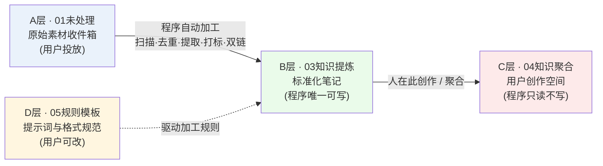
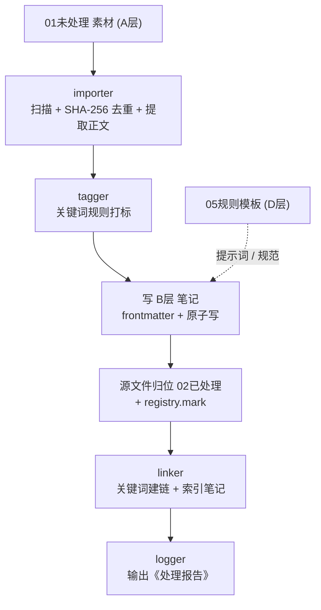

# Obsidian 知识库自动化搭建工具（obsidian-kb）

> **摘要**：一个采用卢曼卡片盒（Zettelkasten）式分层思想设计的通用化、可配置、幂等的 Obsidian 知识库自动化程序。其处理主链路为 **自动建库 → 批量导入归类 → 自动打标 → 自动双链 → 生成索引笔记 → 输出处理报告**，支持一次性执行与定时同步两种运行模式。
>
> **设计理念**：让 AI 做 AI 擅长的事，让程序做程序擅长的事，让人做人擅长的事。程序默认只自动化 **A→B 层**，绝不触碰 **C 层（用户的创作空间）**；D 层承载可随时调整的加工规则。

## 目录

- [1. 项目概述](#1-项目概述)
- [2. 核心特性](#2-核心特性)
- [3. 知识库分层模型：A/B/C/D 四层架构](#3-知识库分层模型abcd-四层架构)
- [4. 系统架构](#4-系统架构)
- [5. 模块职责](#5-模块职责)
- [6. 核心执行流程与数据流](#6-核心执行流程与数据流)
- [7. 配置说明](#7-配置说明)
- [8. 使用说明](#8-使用说明)
- [9. 扩展开发](#9-扩展开发)
- [10. 排错速查](#10-排错速查)
- [11. 环境要求](#11-环境要求)
- [12. 许可证](#12-许可证)

---

## 1. 项目概述

本工具用于把零散的原始资料（PDF、Word、Markdown、纯文本、图片等）自动整理为结构化的 Obsidian 知识库。它不替代人的思考与创作，而是把**可程序化的流水线工作**（导入、归类、打标、双链、索引、报告）自动化，从而让人专注于**知识聚合与创作**。

其设计建立在一个清晰的能力边界之上：程序的活动范围被严格限定在 **A 层（原料）到 B 层（标准化笔记）** 之间；**C 层（创作空间）永远留给用户**；**D 层（规则模板）由用户定义并驱动程序的加工行为**。该分层模型详见[第 3 章](#3-知识库分层模型abcd-四层架构)。

## 2. 核心特性

1. **自动建库**：一键生成标准目录、Obsidian 基础配置（附件路径等）、提示词模板、含双链的示范笔记，用 Obsidian 打开即可预览知识图谱。
2. **批量导入归类**：`01未处理`（可配置 `import.extra_sources` 增加更多源）内的 `.md/.txt/.pdf/.docx`、图片自动归类——PDF 默认提取正文生成笔记、原件归档；图片直接进附件；txt 自动转 Markdown。
3. **规范化 frontmatter**：`title / tags / created / updated / source / category / status`，已存在笔记保留用户字段、只刷新 `updated`，绝不覆盖手工归类。
4. **自动打标**：配置文件中的「关键词 → 标签」规则表 + 正文 `#标签` 提取，自动去重限量。
5. **双链 + 知识图谱**：**关键词是链接的唯一依据**——共享 ≥3 个相同关键词即建链（阈值可调）、每篇最多保留前 8 条强相关链接、新增笔记自动链接其自身原始素材；为标签/分类生成 B 层索引笔记（双向链接回链），Obsidian 图谱直接可见。
6. **日志与报告**：每次运行输出统计（扫描/导入/新增/跳过/失败/标签/关联/索引），生成 Markdown《处理报告》并打印明细。
7. **幂等与容错**：内容 SHA-256 注册表去重，重复运行不重复导入；文件名冲突自动加序号；编码自动探测（UTF-8/GBK）；单文件失败不阻断整体；`--dry-run` 安全演练。

---

## 3. 知识库分层模型：A/B/C/D 四层架构

本工具以「四层知识库」作为核心组织范式。理解这四层是理解整个程序行为边界的前提。

### 3.1 设计理念

知识库的内容按**加工阶段与归属权**被切分为四层：

- **A 层（原料 / 收件箱）** 与 **B 层（程序产出 / 知识提炼）** 之间是程序自动化的主链路；
- **C 层（人的创作空间）** 是程序的能力禁区，仅可读、不可写；
- **D 层（规则与提示词）** 决定程序「如何加工」，由用户维护、程序读取。

> 一句话概括：**A 进原料 → 程序自动加工成 B（结构化知识）→ 人在 C 做创作 → D 控制加工规则。**

### 3.2 四层定义

| 层 | 对应目录 | 名称 | 角色 | 写入方 |
| --- | --- | --- | --- | --- |
| **A 层** | `01未处理/` | 原料区 / 收件箱 | 用户统一投放原始素材；CLI 导入、GUI 拖拽、AI 整理均只扫描此目录 | 用户 |
| **B 层** | `03知识提炼/` | 知识提炼区 | 程序自动生成的标准化笔记（自动打标 + 自动双链 + 索引），是知识库机器可读的主体 | 程序（唯一可写笔记层） |
| **C 层** | `04知识聚合/` | 知识聚合区 | 用户的创作空间：组合、改写、写作、产出洞察 | 用户 |
| **D 层** | `05规则模板/` | 规则模板区 | 可自定义的加工配方（如「豆包知识提炼提示词」、格式规范），程序每次运行读取最新内容 | 用户 |

> 说明：`02已处理/`（源文件归位）、`06附件/`（PDF/图片归档）、`07日记/` 属**辅助归档目录**，并不属于 A/B/C/D 四层概念。

### 3.3 权限矩阵（程序 / 用户）

| 层 | 目录 | 程序读取 | 程序写入 | 用户读取 | 用户写入 | 说明 |
| --- | --- | --- | --- | --- | --- | --- |
| A | `01未处理/` | ✓ | 处理后移出源文件 | ✓ | ✓（投放素材） | 原料入口 |
| B | `03知识提炼/` | ✓ | ✓（唯一可写笔记层） | ✓ | — | 程序产出 |
| C | `04知识聚合/` | ✓ | ✗（只读不写） | ✓ | ✓ | 创作空间，程序绝不触碰 |
| D | `05规则模板/` | ✓ | ✗ | ✓ | ✓ | 配方区，用户可改 |
| — | `02/06/07` | — | 仅归档 | — | ✓ | 辅助归档 |

**关键约束**：双链引擎默认只处理 B 层，对 C 层「只读不写」；`frontmatter.ensure_frontmatter()` 在更新 B 层笔记时仅刷新规范字段，绝不覆盖用户手工归类。

### 3.4 数据流图



### 3.5 目录映射与 B 层元数据

```
<库根>/
├── 01未处理/                 # A 层：统一导入源（AI 整理与 CLI 命令都扫这里）
├── 02已处理/                 # 已导入/已提炼的源文件归位（辅助归档）
├── 03知识提炼/               # B 层：标准化笔记（自动打标 + 自动双链）
├── 04知识聚合/               # C 层：你的创作空间（程序不碰）
├── 05规则模板/               # D 层：提示词与格式规范（可自行修改）
├── 06附件/                   # PDF、图片等原始文件归档（辅助归档）
├── 07日记/
├── README.md
└── .kb_registry.json      # 幂等注册表（内容哈希 → 已导入记录）
```

**B 层笔记标准 frontmatter 字段**：`title / tags / created / updated / source / category / status`（已存在笔记只刷新 `updated`，绝不覆盖手工归类）。

---

## 4. 系统架构

程序采用「**配置驱动 + 分层模块 + 双入口（CLI / GUI）**」结构。所有业务逻辑都在 `obsidian_kb/` 包内，两个入口（`run.py` 命令行、`gui_server.py` 图形服务）只是不同的调度外壳，最终都调用同一批核心模块，从而保证行为一致。

### 4.1 总体结构

```
                         ┌─────────────────────────────────────────────┐
                         │                 入口层 (Entry)                │
                         │   run.py ──► cli.py           gui_server.py    │
                         │   (命令行 argparse)           (本地 HTTP 服务)  │
                         └───────────┬───────────────────────┬──────────┘
                                     │                       │
                         ┌───────────▼───────────────────────▼──────────┐
                         │            配置层 (Config)                     │
                         │   config.py：load_config / deep_merge /        │
                         │   validate_config / resolve_vault_root         │
                         │   数据源：kbconfig.yaml(.json) ⊕ 内置默认值      │
                         └───────────┬───────────────────────┬──────────┘
                                     │                       │
        ┌────────────────────────────▼──────────┐   ┌────────▼─────────────────────┐
        │           核心处理管线 (Pipeline)        │   │   自动化层 (Automation)        │
        │  vault → importer → tagger → linker →   │   │  doubao_automation.py         │
        │  frontmatter → registry → logger        │   │  （豆包键鼠模拟 A→B 提炼）      │
        └────────────────────────┬───────────────┘   └────────┬─────────────────────┘
                                 │                              │
                         ┌───────▼──────────────────────────────▼───────┐
                         │   支撑/基础设施 (Infra)                        │
                         │  scheduler.py（定时）  logger.py（日志报告）     │
                         │  frontmatter.py（元数据）  registry.py（幂等）   │
                         └───────────────────────────────────────────────┘
```

### 4.2 目录与文件清单

```
obsidian-knowledge-builder/
├── run.py                      # CLI 总入口（仅转发到 cli.main）
├── gui_server.py               # GUI 本地服务端（HTTP + ThreadingHTTPServer）
├── gui_index.html              # GUI 前端界面
├── launch-kb-assistant.bat     # 双击启动 GUI（自动开浏览器）
├── kbconfig.yaml               # 默认配置（YAML，可改；删键即回退默认值）
├── requirements.txt            # 依赖清单
├── demo/                       # 演示/回归脚本（backfill、migrate、e2e、浏览器上传修复等）
└── obsidian_kb/
    ├── __init__.py             # 版本号（__version__ = "1.0.0"）+ 设计理念说明
    ├── cli.py                  # 命令行接口与全部子命令实现
    ├── config.py               # 配置加载 / 校验 / 合并
    ├── vault.py                # 建库（目录结构 + Obsidian 配置 + 模板）
    ├── importer.py              # 批量导入归类（扫描/去重/提取/写笔记/归位）
    ├── tagger.py               # 关键词规则自动打标
    ├── linker.py               # 双链关联引擎 + 索引笔记生成
    ├── frontmatter.py          # YAML frontmatter 解析/生成/更新
    ├── registry.py             # 幂等注册表（SHA-256 去重）
    ├── logger.py               # 日志系统 + 处理报告
    ├── scheduler.py            # 定时同步（watch 循环 / Windows 计划任务）
    └── doubao_automation.py    # 豆包键鼠自动化（Windows 专用，ctypes）
```

---

## 5. 模块职责

### 5.1 职责总表

| 模块 | 一句话职责 |
| --- | --- |
| `cli.py` | 命令行总编排，把子命令串成管线 |
| `config.py` | 配置的唯一真相来源（默认⊕用户，深合并） |
| `vault.py` | 一键建库/补齐，写目录、Obsidian 配置、模板 |
| `importer.py` | 扫描去重归类提取，把素材变成 B 层笔记 |
| `tagger.py` | 关键词规则打标 |
| `linker.py` | 关键词建链 + 索引笔记（双链引擎） |
| `frontmatter.py` | YAML 元数据解析/生成，保留用户字段 |
| `registry.py` | SHA-256 幂等注册表 |
| `logger.py` | 日志 + Markdown 处理报告 |
| `scheduler.py` | watch 循环 / Windows 计划任务 |
| `doubao_automation.py` | 豆包键鼠模拟 A→B 提炼（Windows） |
| `gui_server.py` | 本地 HTTP 服务，图形界面后端 |

### 5.2 分层详解

**入口层**

- **`run.py`**：仅一行 `sys.exit(main())`，把控制权交给 `cli.main`。
- **`cli.py`**：命令行接口与核心编排者。解析 `init/import/link/sync/watch/schedule/report` 子命令，内联 `_sync()` 把「导入→双链→索引→报告」串成一条管线，每个子命令对应一个 `cmd_*` 函数。支持 `--config`、`--root`、`--dry-run`、`--no-move`、`--no-dedupe` 全局/局部参数。

**配置层 —— `config.py`**

- **唯一数据源策略**：`load_config()` = 内置 `DEFAULT_CONFIG` **深合并**用户配置（YAML 优先，JSON 兜底），未声明的键全部用默认值。
- 支持格式：`.yaml/.yml`（需 PyYAML，缺失则报错提示）与 `.json`；自动探测 `kbconfig.yaml` 等默认文件名（`find_default_config`）。
- `validate_config()`：校验 9 大区块存在且为对象，且 `structure` 必须含未处理/已处理/B/C/D/附件/日记等关键目录。
- `resolve_vault_root()`：库根解析——`vault.root` 优先，否则用 `<cwd>/<vault.name>`。
- `DEFAULT_CONFIG` 集中了四层架构目录、标签规则、链接阈值（共享≥3 关键词、每篇≤8 链接）、命名规范、定时参数等全部可调项。

**建库层 —— `vault.py`**

`init_vault(cfg, root, force)` 负责「从无到有」或「补齐」知识库：

1. 按 `structure` 顺序创建目录（01未处理…07日记）。
2. 写 `.obsidian/app.json`（附件目录、新笔记位置等 Obsidian 基础设置）。
3. 写 **D 层规则模板**：`05规则模板/豆包知识提炼提示词.md`（用户可随时改，程序每次读最新）。
4. 写库 `README.md` 与 B 层 3 篇示范笔记（含 `[[双链]]`，供图谱预览）、日记模板。
5. **空库保护**：若目录已有内容（非 `.obsidian`），仅补齐缺失目录、绝不覆盖用户文件；`--force` 才覆盖模板。
6. **幂等**：`_write_if_missing()` 默认跳过已存在文件。

**导入层 —— `importer.py`（最核心的处理模块）**

`run_import()` 流程（扫描 → 哈希去重 → 归类 → 打标 → 生成 frontmatter → 写笔记 → 源文件归位 → 登记注册表 → 日志）：

- **扫描源**：`import.inbox`（默认 01未处理）+ `extra_sources`；`_iter_files` 递归扫描，跳过隐藏目录/日志目录，支持 `max_depth`。
- **类型分流**：
  - 附件类（图片等 `attachment_exts`）→ 直接归档 `06附件/`。
  - 文档类 `.md/.txt` → 内容即正文（txt 转 Markdown，剥离旧 frontmatter 由程序重建）。
  - `.pdf` → `pdf_mode=extract` 提取正文（PyMuPDF 优先，pypdf 回退），提取失败或无正文则归档。
  - `.docx` → `python-docx` 提取正文，失败则归档。
- **幂等去重**：`registry.hash_file()` 计算 SHA-256，`dedupe_by_hash` 开启时重复内容直接跳过。
- **打标**：实例化 `Tagger`，根据文件名+正文生成标签。
- **写笔记**：`build_note_name`（日期前缀+规范化+冲突加序号）、`_write_note_atomic`（先写 `.tmp` 再 `os.replace`，防半截文件）、`frontmatter.build_frontmatter` 组装元数据。
- **归位**：源文件 `_move_safe` 移入 02已处理（或 06附件），冲突自动加时间戳后缀。
- **登记**：`registry.mark()` 记录 `哈希→笔记/源` 映射。
- **容错**：单文件失败不阻断整体，`--dry-run` 只演练不写文件。

**打标层 —— `tagger.py`**

`Tagger` 类实现「关键词→标签」规则引擎：

- 规则表来自 `tags.rules`（每条 `{tag, keywords}`）。
- 命中判定：文件名（权重最高）→ 正文前 500 字 → 全文，子串匹配（ASCII 部分忽略大小写）。
- 可选从正文提取 `#hashtag`（`HASHTAG_RE` 正则）。
- 按命中次数降序，保留 `max_tags`（默认 10）个，自动去重。

**双链层 —— `linker.py`（双链规则引擎的核心）**

`run_linking()` + `generate_indexes()`，严格按「**关键词是链接的唯一依据**」：

- `collect_notes()`：收集 B 层（可选含 C 层）笔记，构建 `NoteInfo`，关键词来源 = 正文 `**关键词**：` 行 + frontmatter 关键词/tags + tags，全转小写去重。
- **建链规则**：关键词倒排索引 → 共享关键词数 ≥ `min_keywords`（默认 3）即建链 → 按共享数降序，每篇最多 `max_links_per_note`（默认 8）条。
- **三类链接**（自动追加到笔记尾部「## 双向链接」区块）：
  1. 原始素材回链 `- [原始素材](相对路径)`（`frontmatter.source` 优先，注册表回退，占 1 名额）。
  2. 相关笔记互链 `- [[笔记名]] — 共享关键词：交集`。
  3. 索引笔记链接（不受 8 条限制，每命中一个关键词/分类值一条）。
- **幂等**：只追加缺失链接，已存在链接不重复写；变更后 `touch_updated()` 刷新 `updated` 字段。
- `generate_indexes()`：为每个关键词/分类值生成 `索引_<关键词>.md` / `索引_分类_<分类值>.md`（`# 索引：主题` + `- [[B层笔记]]` 列表，无 frontmatter），与 B 层互相双链。
- 约束：默认只处理 B 层，C 层「只读不写」，程序不碰 C 层。

**元数据层 —— `frontmatter.py`**

- `parse_frontmatter()` / `build_frontmatter()`：YAML frontmatter 解析与生成；YAML 不可用时回退轻量文本解析器（`_parse_fm_fallback`），保证工具始终可用。
- `ensure_frontmatter()`：**保留用户手写字段**（如 aliases/author），只合并/更新 title/tags/created/updated 等规范字段，`created` 仅缺失时写，`updated` 每次刷新。
- `read_text_auto()` / `write_text_auto()`：自动探测 UTF-8/GBK 编码，统一 `\n` 换行，`newline="\n"` 防 Windows 双回车。

**幂等层 —— `registry.py`**

- `Registry` 以 `.kb_registry.json` 记录「内容 SHA-256 → 已导入状态」。
- `hash_file()` 分块读取支持大文件；`contains/mark/get/all_entries` 供导入与链接引擎查询。
- **损坏自愈**：加载失败自动重建为空表，不阻断流程。
- 保证：同一内容重复运行不重复导入；同名不同内容正常处理（文件名冲突加序号）。

**日志报告层 —— `logger.py`**

- `Report` 类收集运行统计：扫描数、导入数、新增笔记、更新笔记、归档附件、跳过（重复）、失败、标签计数、新增双链、关联关系、错误与逐条明细。
- `setup_logging()`：控制台 INFO（统一 UTF-8 规避 Windows 中文乱码）+ 文件 DEBUG（`处理日志/kb_YYYYMMDD.log`）。
- `write_report()`：输出 Markdown《处理报告》，同时写 `处理报告_时间戳.md` 与最新 `处理报告.md`，分「运行统计 / 自动标签 / 关联关系 / 处理明细 / 错误」五段。

**调度层 —— `scheduler.py`**

- `watch_loop()`：程序常驻后台，按 `scheduler.interval_minutes`（默认 30）轮询执行 sync，Ctrl+C 退出。
- `install_task()/uninstall_task()`：生成 `run_sync.bat`（chcp 65001 + 调用 sync），通过 `schtasks` 注册/卸载 Windows 每日计划任务（非 Windows 时给 crontab 提示）。

**自动化层 —— `doubao_automation.py`（Windows 专用）**

零第三方依赖，纯 `ctypes` 调用 Win32（user32/kernel32/advapi32）实现豆包桌面/网页版键鼠模拟，实现「批量素材提炼 A→B」：

- **坐标体系**：用户按 F6 记录「输入框/下翻箭头/复制按钮」三坐标，按启动途径（web/desktop）分两套存于 `豆包坐标.json`。
- **核心循环 `refine_loop()`**：
  1. 扫描 01未处理素材 → 2. `build_prompt()` 组装提示词（GUI send_format → D层 `.md` → 内置默认，`{素材内容}` 占位替换）→ 3. 置前并最大化豆包窗口 → 4. 点击输入框→粘贴(提示词+素材)/文件直发→回车发送 → 5. 清空剪贴板后轮询「点复制→读剪贴板」等待新回复（`_wait_new_reply`，超时兜底）→ 6. `parse_refined_note()` 去代码块、提一句话总结 → 7. 存 B 层笔记、素材移 02已处理、登记注册表。
- 支持文本与文件直发（CF_HDROP 剪贴板）、失败重试一次、超大文件（>50MB）跳过、Esc/停止信号中断。
- `diagnostic()`：环境诊断（管理员权限、豆包窗口、UIPI 权限冲突提示、坐标与鼠标模拟测试）。
- 关键细节：显式声明所有 Win32 函数 `argtypes/restype`（64 位下 HANDLE/指针若按 int 截断会崩溃，代码注释中有详细说明）。

**GUI 层 —— `gui_server.py` + `gui_index.html`**

- 本地 `ThreadingHTTPServer`（127.0.0.1，默认端口 8765，被占用自动换端口，地址写 `gui_url.txt`），**仅用 Python 标准库，数据不出本机**。
- 全局状态 `_state` / `_coords` / `_busy` / `_doubao_*` 等在线程间协调；`_GuiLogHandler` 把子线程日志转发到界面缓冲。
- 提供 ~25 个 HTTP 接口（`/api/status`、`/api/init`、`/api/upload`、`/api/prompts`、`/api/debug/*`、`/api/trash/*`、豆包 `/api/doubao/*` 等），内部均复用 `obsidian_kb` 核心模块与 `doubao_automation`。
- 提炼完成后同样调用 `linker.run_linking()` + `generate_indexes()`，与 CLI 行为一致。
- 调试模式（`/api/debug/toggle`）记录各目录快照，可「复位」撤销调试期间操作。

---

## 6. 核心执行流程与数据流

### 6.1 同步管线



### 6.2 幂等机制要点

1. **内容去重**：每个文件算 SHA-256 存入 `.kb_registry.json`，重复内容直接跳过。
2. **合并而非覆盖**：`frontmatter.ensure_frontmatter()` 保留用户字段，只更新规范字段；链接引擎只追加缺失链接。
3. **原子写**：笔记/注册表均「写 `.tmp` → `os.replace`」，避免半截文件。
4. **提交顺序**：源文件「移动→写笔记→登记」严格有序，任一步失败都不会留下「未登记却已处理」的重复导入隐患。
5. **编码容错**：UTF-8/GBK 自动探测；YAML 缺失时回退 JSON 配置与文本 frontmatter 解析。
6. **失败隔离**：单文件异常被捕获、计入报告，不阻断整体同步。

---

## 7. 配置说明

`kbconfig.yaml` 主要可调参数：

| 区块 | 关键参数 | 作用 |
| --- | --- | --- |
| `vault` | `name` / `root` | 库名 / 库根路径 |
| `structure` | 逻辑名→相对路径 | 目录结构，可自由增删 |
| `import` | `inbox` / `pdf_mode` / `dedupe_by_hash` / `extra_sources` / `max_depth` | 导入源、PDF 提取或归档、幂等开关、额外源 |
| `frontmatter` | `fields` / `status_new` / `date_format` | 元数据规范 |
| `tags` | `rules`（tag+keywords）/ `extract_hashtags` / `max_tags` | 打标规则表 |
| `linking` | `strategy` / `min_keywords` / `max_links_per_note` / `gen_index` / `include_c` | 双链策略（关键词阈值、链接上限、是否纳入 C 层） |
| `naming` | `date_prefix` / `sanitize` / `max_len` | 文件名规范 |
| `scheduler` | `interval_minutes` / `task_time` | 定时参数 |
| `logging` | `log_dir` / `report_file` | 日志与报告目录 |

**常用定制**：

- 改标签体系：编辑 `tags.rules`（如新增「轨道交通」「电力电子」规则，仓库已内置示例）。
- 调双链密度：`linking.min_keywords`（共享关键词阈值）、`linking.max_links_per_note`（每篇链接上限）。
- 对接自己的 AI：把 D 层「豆包知识提炼提示词」换成任意 LLM 工作流，程序只编排流程、不依赖豆包 API。
- 加导入源：`import.extra_sources` 增加扫描目录。

---

## 8. 使用说明

### 8.1 命令行快速开始

```bash
# 0. 安装依赖（Python 3.8+）
pip install -r requirements.txt

# 1. 建库（重复运行安全；--force 覆盖模板）
python run.py init --root D:\我的知识库

# 2. 把要整理的资料丢进 <库>/01未处理/，然后一次性同步
python run.py sync --root D:\我的知识库

# 3. 定时自动同步（命令行方式）
python run.py watch --interval 30              # 内置循环常驻
python run.py schedule --install --time 09:00  # Windows 计划任务（每日 09:00）

# 4. 查看处理报告
python run.py report --root D:\我的知识库
```

### 8.2 命令一览

| 命令 | 说明 |
| --- | --- |
| `init [--root R] [--force]` | 创建标准知识库结构（四层架构 + 模板 + 示范笔记） |
| `import [SRC] [--dry-run] [--no-move] [--no-dedupe]` | 批量导入（SRC 缺省 = 01未处理） |
| `link` | 仅执行双链引擎 + 索引笔记 |
| `sync [--dry-run]` | 一次性：导入 + 打标 + 双链 + 索引 + 报告 |
| `watch [--interval MIN]` | 内置循环定时同步（Ctrl+C 退出） |
| `schedule install/uninstall [--time HH:MM]` | 注册/卸载 Windows 计划任务 |
| `report` | 查看最新处理报告 |
| `--version` | 版本号 |

所有命令均支持 `--config <路径>` 指定配置文件（默认查找当前目录 `kbconfig.yaml` / `.json`）。

### 8.3 图形操作窗口（轻度用户首选）

**双击「launch-kb-assistant.bat」**，浏览器自动弹出中文按钮界面，全部操作一键完成，无需输入任何命令：

- **知识库放在哪里** —— 填写知识库文件夹路径：点「保存位置」保存、点「创建知识库」一键生成标准结构、点「打开该路径」在文件管理器查看/新建。
- **未处理资料（01未处理）** —— 点「选择资料文件夹 / 文件」或直接把文件**拖入虚线框**自动放入 01未处理（支持多文件；同名文件自动改名 `名字_时间戳.扩展名`，不覆盖已有文件；拖入文件夹会被跳过并提示，请改用「选择资料文件夹」）；列表支持全选/勾选删除/清空（删除的文件移入知识库内「回收站」文件夹，可在文件管理器中找回）。
- **提示词格式配置** —— 在「豆包自动整理」区块可自由编辑「发送格式」（发给 AI 的提示词，`{素材内容}` 处自动替换为素材正文），保存后写回知识库 `05规则模板/` 目录；其下方另有「B层知识提炼文件的生成逻辑与结构（只读参考）」只读文本框，展示 B 层笔记的组成部分、拼接方式与完整生成链路（A→B），不可编辑。
- **AI 自动整理** —— 把素材放进知识库的 **01未处理** 文件夹，先选「启动途径」（网页版 / 桌面版 exe），再记录豆包三个按钮坐标（输入框/下翻/复制，鼠标移到位置按 F6），点「开始」自动把窗口切到前台并最大化，按固定时序执行：点击输入框 → 0.5s → 粘贴素材+提示词并发送 → 等待新回复（轮询复制，生成完才复制到新内容）→ 生成 B 层标准笔记，素材随之移入「02已处理」；处理条数可设、可随时停止（界面按钮或 Esc）。
- **高级设置（调试模式）** —— 开启后整理跳过链接引擎/处理报告，并记录各目录快照；点「复位」可撤销调试期间的全部操作：删除新建的笔记/日志，把已处理素材移回 01未处理。
- 实时运行日志 + 最近处理结果一目了然，点「退出知识库助手」即可停止。

> 界面文件：`gui_server.py`（本地服务）+ `gui_index.html`（界面）。
> 仅用 Python 标准库，数据只在本机 `127.0.0.1` 流转，不上传任何内容。
> 服务端口自动选择（默认 8765，被占用时自动换端口，实际地址记录在 `gui_url.txt`）。
> 豆包坐标存于程序目录 `豆包坐标.json`（格式：`{"desktop": {坐标...}, "web": {坐标...}}`，两套坐标互相独立）。

---

## 9. 扩展开发

- **新增文档格式**：在 `importer.py` 的 `_extract_*_text` 加对应提取函数，并在 `include_exts`/`archive_exts` 注册扩展名。
- **新增打标策略**：扩展 `Tagger` 或在 `tags.rules` 增规则；`linking.strategy` 已预留 `keywords/title_tags/none` 三种模式。
- **替换 AI 提炼后端**：`doubao_automation.refine_loop` 是 A→B 提炼的唯一耦合点，可改为调用本地 LLM API，把 `build_prompt/parse_refined_note` 复用即可。
- **自定义界面**：GUI 走标准 HTTP API（`gui_server.py` 顶部有完整接口清单），前端 `gui_index.html` 可任意替换。
- **跨平台**：除 `doubao_automation.py`（仅 Windows ctypes）与 `schedule` 的 `schtasks` 外，其余模块均可跨平台（Windows/macOS/Linux）。

---

## 10. 排错速查

| 现象 | 可能原因 / 处理 |
| --- | --- |
| `检测到 YAML 配置文件，但未安装 PyYAML` | `pip install pyyaml`，或改用 `.json` 配置 |
| PDF 被直接归档而非提取正文 | 未装 PyMuPDF/pypdf，或 PDF 是扫描图；装 `PyMuPDF` 或 `pypdf` |
| `docx` 仅归档 | 未装 `python-docx` |
| 双链不生成 | 笔记共享关键词 < `min_keywords`(3)；检查正文 `**关键词**：` 行 / frontmatter tags |
| AI 自动化点了没反应 | 权限不一致（豆包管理员、本程序普通权限 → UIPI 拦截）；用 `diagnostic()` 诊断并按提示统一权限；先按 F6 正确记录三坐标 |
| 计划任务不执行 | 检查 `run_sync.bat`（chcp 65001 + sync）与 `schtasks /Query` |
| 中文乱码 | 程序已统一 UTF-8，确认终端/编辑器编码为 UTF-8 |

---

## 11. 环境要求

- Python 3.8+（Windows / macOS / Linux）
- Obsidian（可选，用于查看知识库与关系图谱）
- 依赖：PyYAML、PyMuPDF（可选 python-docx / pypdf）

---

## 12. 许可证

本项目采用仓库根目录 [LICENSE](LICENSE) 文件规定的开源协议。若未提供 LICENSE 文件，请在使用前联系作者确认授权范围。
